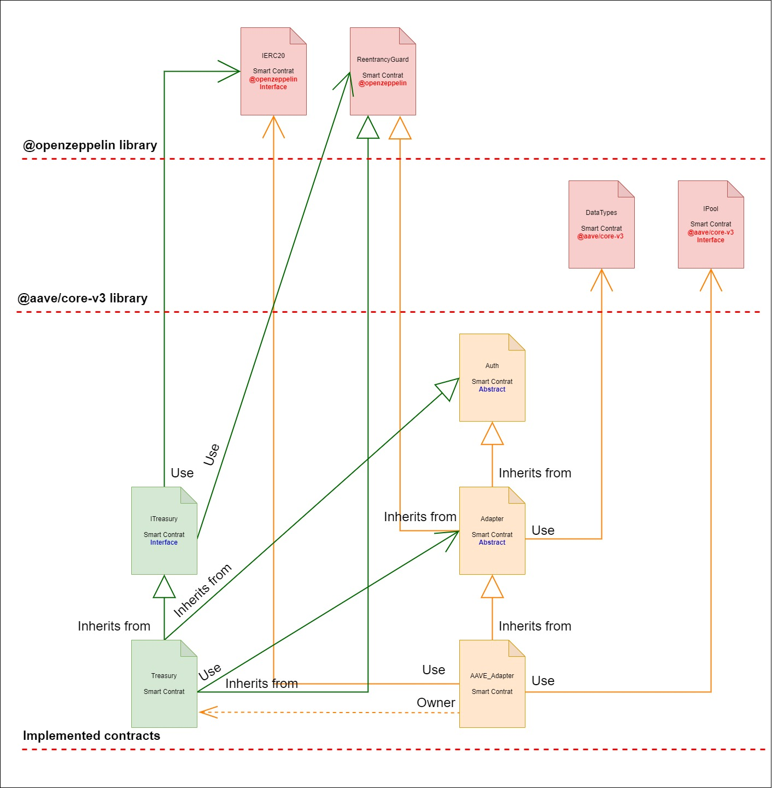
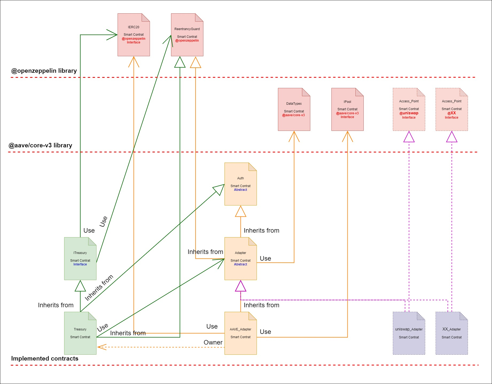

# DERA:Liquidity pools and DeFi protocols integration
##### Author: David Gimenez Gutierrez

## Objective

This repository features a protocol that integrates with different liquidity pools and DeFi protocols (for example: uniswap, AAVE, etc.).

In this instance it presents the integration with AAVE, but shows that its structure is built with abstractions to expand its functionality in a modular way to easily integrate other DeFi protocols.

## Problem description

The following objectives are defined for this implementation.

* **Task 1:** A treasury smart contract should be able to receive USDC or any other stable coin
* **Task 2:** The funds (eg: USDC) are to be distributed among the different protocols and swapped for either USDT or DAI (in case of a liquidity pool).
* **Task 3:** The ratio of these funds to be distributed can be set in the smart contract by the owner of the smart contract and can be changed dynamically after the deployment to the test/mainnet chains.
* **Task 4:** The contract should be able to withdraw the funds in the liquidity pools or DeFi protocols fully or partially.
* **Task 5:** The contract should be able to calculate the aggregated percentage yield of all the protocols.

## Requirements

* **Requirement 1:** Propose detailed solutions in writing as a document and create a visual version of smart contracts as a block diagram
* **Requirement 2:** Write the actual code in Solidity and deploy it to test networks like Polygon Mumbai. 

* **Additional features:**
    * Polygon's main network was forked to be able to operate locally with the connected protocols.
    * Accounts with many funds in MATIC and USDC were impersonated to carry out the tests
    * OpenZeppelin reentrancyGuard was implemented in the contracts and the verification effect interaction pattern was used to prevent reentry attacks.
    * Comment follow the Ethereum ´Natural Specification´ language format (´natspec´) Referencia: https://docs.soliditylang.org/en/v0.8.16/natspec-format.html  

## Solution Summary

Both requirements were met.
The specification of the solution is explained in this readme which includes diagrams of the different components of the solution. 
This repository includes code for the entire solution that accomplishes all requested tasks.
Solution tests are included that show the operation of all components and the complete life cycle of this proof of concept.
The tests are not intended to be exhaustive, so only positive tests that show the main functionality have been included, but the functionalities are not tested to validate correctness exhaustively due to lack of time.

**Contracts deployed in the Mumbai network**
* Treasury contract address: **0x24607936F59c03F79B3b5bAe221aa19D47747aA5**
* AAVE_Adapter contract address: **0x968355B72aEf30e67AE950dF19355c78918BEFDB**

## Solution description

### Solution architecture



As seen in the diagram, the solution is based on the use of abstractions and the creation of adapters.
The Treasury contract is aware of the Abstract contract type "Adapter" and instantiates other Adapter contracts derived from the abstract contract. These Adapter contracts implement the required logic for each protocol to be connected. In this manner, the Treasury contract possesses the capability to interface with any current or future protocol. Creating a new Adapter contract that implements the necessary logic for interfacing with the protocol is the only requirement to enable this functionality
This is a clean, scalable design that encapsulates and abstracts the responsibilities of each component, making it easy to audit and inspect, a very important feature in a smart contract.
Additionally, each interface is completely described in the code following the commenting standard for Solidity and Clean Code.

The following diagram shows what the architecture would look like with the connection to more protocols:



#### Main componentes

* **Treasury contract:** 
It encapsulates the main functionalities managed by the protocol, including adding coins and protocols, investing and withdrawing funds, and communicating with external protocols through adapters.

* **AAVE_Adapter:** 
Inpcasulta all the necessary functionalities to communicate with the AAVE protocol, retrieve information and make execution requests.
In this proof of concept and due to the limited time, only the connection with the AAVE protocol has been implemented, to exemplify the proposed architecture.

* **Adapter:** 
It is the abstract contract that encapsulates the general and basic functionalities of any future adapter contract that will connect with a new external protocol.

* **Auth:** 
This abstract contract implements the ownable pattern to handle access to calls between contracts and with external users.

**Important:** Without the time limitation, the proxy pattern would also have been implemented to allow the protocol to be upgradeable and face necessary functionality adjustments.

#### Interaction with external components

###### OpenZeppelin libraries

* **ReentrancyGuard:** 
I use ReentrancyGuard to prevent reentrancy attacks on contracts. In addition, the "Check-Affect-Interact" pattern was used whenever possible in development to prevent attacks.

###### AAVE Protocol libraries

* **IPool Interface and Pool Contract:** 
It is the main access door contract to the AAVE protocol, it allows interaction with the main functionalities, such as opening a position or obtaining market information and its assets.

## Repository description

### Folders and files

- **Root folder**
    - **assets:** Contains the repository resource files, such as images
    - **scripts:** Contains the script to deploy the contracts on the blockchain. The configuration is set to deploy to the Polygon Mumbai network, but you will need to configure your own .env file. More information about this in the "Solution setup" section.
    - **src:** Contains the solution in smart contracts of the project. It is divided into the following sub folders
        - **abstracts**
            - Adapter.sol: Base adapter abstraction. Encapsulates all responsibility for communication with external protocols
        - **context**
            - Auth.sol: Encapsulates the ownable pattern
            - Import.sol: File used to generate required artifacts
        - **contracts**
            - Treasury.sol: It is the main contract of the solution, where all the functions developed are incorporated and the main actions are carried out. 
            - **adapters**
                - AAVE_Adapter.sol: AAVE protocol adapter. Encapsulates all responsibility for communication with the AAVE protocol
            - **interfaces**
                - ITreasury.sol: Contains the interface of this protocol
    - **test:** Contains the test scripts of the solution. Due to time constraints, the tests have not been designed to be exhaustive, but rather serve the purpose of showing the operation of the main functionalities of the protocol. All implemented functionalities were tested with positive tests (happy path).

### Solution setup

1. Clone/fork the repository
2. install dependencies: 'npm install'
3. Setup your .env file with the following variables:
    * POLYGON_MUMBAI_ACCESSPOINT_URL    // Used to deploy to Mumbai
    * POLYGON_ACCESSPOINT_URL           // Used to run test and fork the Polygon mainnet
    * POLYGON_ACCOUNT                   // Your preferred address
    * POLYGON_PRIVATE_KEY               // Your preferred private key
4. Configure Polygon mainnet network fork in :hardhat.config.js

    ```javascript
    //...
    networks: {
        hardhat: {
            forking: {
                url: process.env.POLYGON_ACCESSPOINT_URL,
                blockNumber: 48487827
            }
        }
    }
    //...
    ```
5. Compile the solution 'npx hardhat compile'
6. Run the solution tests 'npx hardhat test'

    **Note:** In this solution, the network was forked in block no: 48487827, the last one mined at the time of development, and "Infura" was used as a provider node to serve the connection to the Polygon blockchain.
    Change these parameters at will
7. To deploy run de deploy.js script: npx hardhat run scripts/deploy.js --network mumbai

### Dependencies

    - **@nomiclabs/hardhat-ethers:** version ^2.2.3
    - **@openzeppelin/contracts:** version ^5.0.0
    - **@aave/core-v3:** version ^1.18.0
    - **hardhat:** version ^2.18.0
    - **solc:** version ^0.8.21
    - **dotenv:** version^16.3.1

    - Required compiler versions
        - 0.8.21

## Reference links

##### AAVE Protocol

- [Website](https://aave.com/)
- [Documentation](https://docs.aave.com/hub/)
- [Documentation - Developers section](https://docs.aave.com/developers/)
- [GitHub](https://github.com/aave/aave-v3-core/)

##### OpenZeppelin

- [Documentation](https://docs.openzeppelin.com/contracts/4.x/)
- [GitHub](https://github.com/OpenZeppelin/openzeppelin-contracts)

##### Polygon

- [Explorer](https://polygonscan.com/)

## Pending improvements to the protocol

* The requirement *"Deposited funds (e.g. USDC) must be exchanged for USDT or DAI (in the case of a liquidity pool)"* could not be implemented due to lack of time.
The implementation would be following the defined architectural pattern, through Adapter contracts.

1. **Detection of Insufficient Liquidity:** The Treasury smart contract must constantly monitor the amount of funds deposited and in case of insufficient liquidity in the USDC pool, it must decide to exchange part or all of the funds for USDT or DAI.
2. **Exchange of Funds:** To exchange the funds, the smart contract could interact with a decentralized exchange (DEX) service such as Uniswap, SushiSwap, or any other that supports USDC, USDT, and DAI. To perform the exchange logic, an Adapter contract is used that connects to the required exchange. This Adapter will connect to the appropriate liquidity pool and executing the exchange.
3. **Implementation of Exchange Logic:** The logic for determining how many funds to exchange and when to do so must be clearly defined in the smart contract. It can be based on predefined rules, such as minimum liquidity thresholds, or even controlled by administrators or contract governors, depending on the needs.

## Final note

Thank you for your time, consideration, and for considering me for this position and I look forward to the next steps in the process. 
If there are any specific details or preparation that I need to take into account, please  let me know.
Thanks for reading!